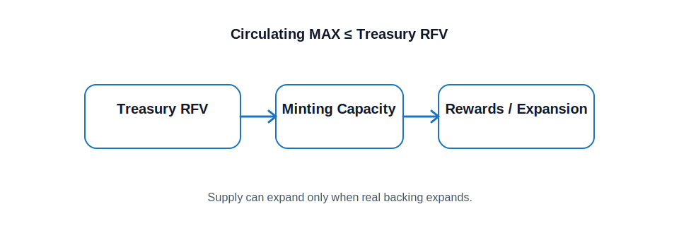

#  Supply Model

Maxum uses an algorithmic supply model tied to treasury backing. The fundamental rule is simple:

**Circulating Supply of MAX ≤ Treasury RFV**

This means the system can only expand within the boundaries of real support. When the treasury grows, the protocol gains room to issue additional MAX for staking rewards, ecosystem incentives, or strategic expansion.

When market conditions are weak, burn mechanics and treasury defenses help offset pressure. This balance between expansion and contraction allows Maxum to grow without defaulting to uncontrolled emissions.

> [!NOTE]
> The supply model keeps growth connected to captured value rather than speculation alone.
