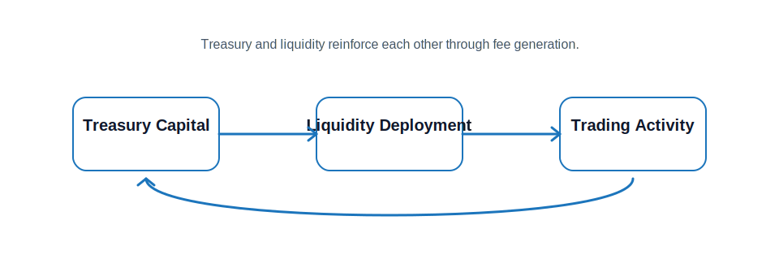

# Treasury

The treasury is the economic core of Maxum.

It does not simply accumulate capital — it converts that capital into productive, permanent liquidity that supports the entire system. Every unit of value captured by the protocol, whether from trading fees, bonding, or ecosystem activity, flows into the treasury and is redeployed to strengthen markets.

This direct link between treasury and liquidity is what allows Maxum to function as a true capital engine.

## How the Treasury Grows

Maxum accumulates capital through multiple coordinated channels:

* **Trading Fees:** Every transaction contributes value directly to the treasury.
* **Bonding Mechanisms:** Users exchange assets for MAX, increasing reserves.
* **Ecosystem Revenue:** Applications generate additional inflows.

As the system scales, treasury growth becomes increasingly driven by real usage rather than external capital.

## From Treasury to Liquidity

Maxum does not treat treasury assets as idle reserves.

Instead, capital is systematically converted into permanent market liquidity that remains within the system. This approach builds on early models like OlympusDAO, where controlling liquidity leads to more stable markets.

Maxum extends this further by ensuring that liquidity is also productive — continuously generating value through trading activity and ecosystem usage.

Once capital enters the treasury, it is deployed into liquidity positions that:

* cannot be withdrawn by external providers
* deepen markets for MAX
* generate ongoing fee-based returns

## Capital That Is Actively Deployed

The treasury exists to put capital to work.

Assets are continuously deployed to:

* expand productive, permanent liquidity
* improve market depth and efficiency
* support ecosystem applications
* reinforce system stability

Capital flows out of the treasury into liquidity, and the value generated flows back into the treasury.

## Treasury–Liquidity Flywheel

The relationship between treasury and liquidity forms a closed loop:

As liquidity expands, markets improve. This attracts more activity, increases fees, and allows the treasury to deploy even more capital.

## Stability Through Ownership

Because liquidity is built and retained by the system, Maxum is less dependent on external participants. In traditional DeFi, liquidity leaves when incentives decline. In Maxum, liquidity is embedded into the system, creating deeper markets, reduced volatility from liquidity shocks, and stronger alignment between capital and growth.

> \[!TIP] Maxum converts treasury capital into permanent market liquidity, creating a system where value is continuously recycled into deeper markets, stronger infrastructure, and sustained growth.
