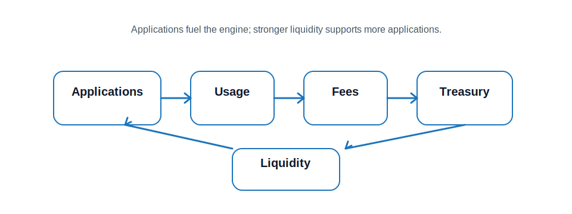

#  Ecosystem

Maxum is designed to support a growing ecosystem of on-chain applications. These may include prediction markets, gaming systems, token launch platforms, and other financial primitives that use MAX as settlement, collateral, or liquidity infrastructure.

Applications matter because they generate real activity. That activity creates fees, strengthens the treasury, and drives demand for the assets and markets that Maxum supports. In this way, the ecosystem is not separate from the protocol — it is a direct contributor to the capital engine itself.

As the ecosystem expands, more value flows through the system. That value reinforces liquidity, improves market depth, and supports further application growth.

> [!TIP]
> Applications are the fuel of the Maxum engine. They turn liquidity into revenue-generating infrastructure.
