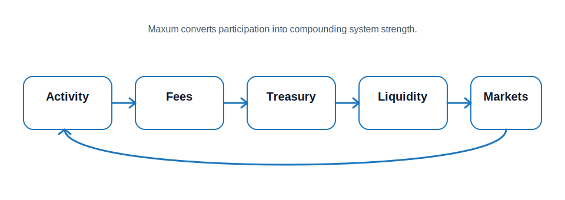

# Economic Flywheel

Maxum operates through a self-reinforcing economic loop that converts activity into long-term system strength. At its core, the protocol is designed so that every interaction — whether it is trading, liquidity provision, or application usage — contributes to the expansion of liquidity and the growth of the treasury.

The process begins with activity. When users trade, interact with applications, or move capital through the system, value is generated in the form of fees. These fees are captured and redirected into the protocol rather than lost to the outside.

Once captured, this value flows into the treasury. The treasury acts as the coordination layer of the system, accumulating capital that can be used to reinforce markets and support growth. Rather than remaining idle, treasury capital is actively deployed to expand liquidity and improve market depth.

As liquidity deepens, the system becomes more efficient. Slippage decreases, trading becomes more attractive, and applications built on top of Maxum gain stronger infrastructure. This improved environment encourages more participation, which increases activity across the ecosystem.

That increased activity generates more fees, and the cycle continues.

This flywheel is what allows Maxum to grow without relying on external incentives or continuous capital inflows. Instead of renting liquidity or depending on emissions, the system compounds its own activity.

The more the protocol is used, the stronger it becomes.

## Why the Flywheel Matters

Traditional DeFi systems often break because they rely on temporary incentives. Liquidity is attracted through rewards, but once those rewards decline, capital exits and markets weaken.

Maxum avoids this failure mode by ensuring that value generated inside the system is retained and reinvested. Every cycle strengthens liquidity rather than diluting it.

> \[!TIP] The Maxum flywheel turns usage into infrastructure — every transaction contributes to deeper liquidity, stronger markets, and long-term system growth.
