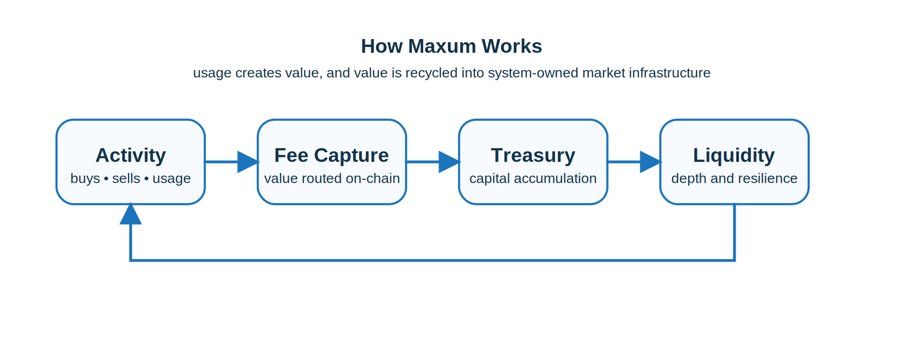

#  Mechanics (MAX)

Maxum operates as a self-reinforcing economic system that captures value from market activity and converts it into productive, permanent liquidity. At its core, the system is designed so that every interaction — whether it is trading, bonding, or participating in applications — contributes to the long-term strength of the protocol.

Unlike traditional DeFi systems that depend on external liquidity providers or purely inflationary rewards, Maxum internalizes value flow. Fees, treasury growth, and liquidity expansion are interconnected, forming a feedback loop that compounds over time.

To achieve this, Maxum relies on several core mechanisms that work together to drive growth, stability, and capital efficiency.

## The Core Loop

At the center of Maxum is a simple sequence: activity generates fees, fees strengthen the treasury, the treasury expands liquidity, and stronger liquidity supports more activity. The loop is straightforward, but the effect compounds as the system scales.

Every taxable interaction strengthens the protocol. Rather than leaking value outward, the system captures and reinvests it.

## Mechanisms Working Together

Maxum’s design combines:

* value capture through trading fees
* treasury expansion through bonding and ecosystem revenue
* liquidity retention through system-controlled deployment
* user alignment through staking, vesting, and governance

These are not isolated features. They are coordinated systems designed to continually convert activity into deeper markets and stronger infrastructure.

> [!TIP]
> Maxum’s mechanics are built to recycle value internally, making each round of participation more valuable than the last.
