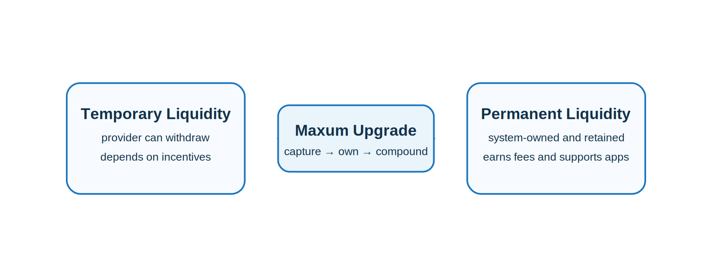

#  Productive, Permanent Liquidity

Maxum is built on a simple but critical idea: liquidity should not be temporary — it should be retained, reinforced, and continuously put to work.

In most DeFi systems, liquidity is treated as a rented resource. Protocols offer incentives to attract capital, but that capital remains external. When incentives decline or market conditions shift, liquidity exits, leaving behind shallow markets and fragile systems.

Maxum rejects this model entirely.

Instead of renting liquidity, Maxum converts value generated within the system into productive, permanent liquidity. This liquidity is retained by the protocol and cannot be withdrawn, ensuring that market depth remains stable regardless of external conditions.

## What Makes Liquidity Productive

Liquidity in Maxum is not passive. It does not simply sit in pools waiting for activity — it actively generates value.

As trading activity flows through the system, fees are captured and distributed across liquidity providers and the treasury. This means that liquidity itself becomes a source of yield, directly tied to the level of economic activity within the ecosystem.

The more the system is used, the more productive its liquidity becomes.

## What Makes Liquidity Permanent

Maxum ensures that liquidity remains within the system.

Rather than relying on external providers who can withdraw capital at any time, the protocol builds its own liquidity base through treasury expansion, bonding, and internal value capture. This liquidity is embedded into the system’s structure and cannot exit under normal conditions.

This permanence creates stability. Markets supported by retained liquidity are deeper, more resilient, and less sensitive to short-term volatility.

## Why This Matters

Because liquidity is both productive and permanent:

* market depth increases over time
* capital efficiency improves
* reliance on external incentives disappears
* the system becomes more stable as it grows

> [!TIP]
> Maxum transforms liquidity into productive, permanent liquidity that powers on-chain economies.
