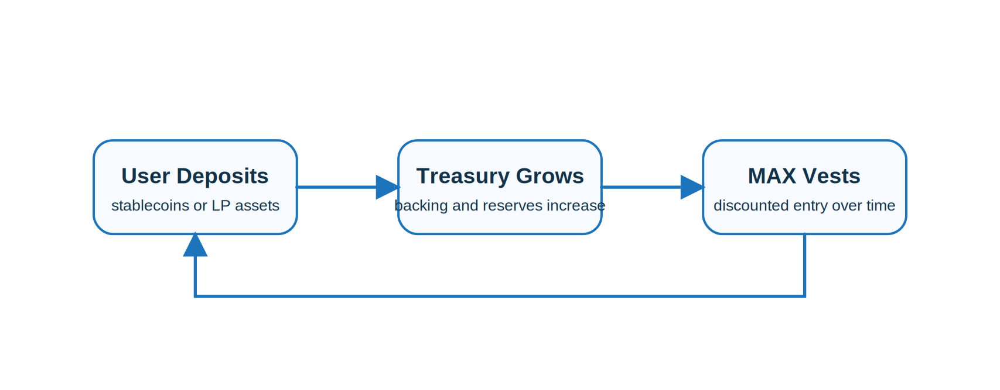

#  Bonding

Bonding is one of Maxum’s primary treasury growth mechanisms. Users exchange stablecoins or liquidity tokens for MAX at a discount. In return, the protocol receives assets that strengthen treasury backing and expand the liquidity base.

Bonded tokens typically vest over time, which helps control supply entry and reduces immediate sell pressure. This allows the system to grow in a more measured way than pure emissions.

The purpose of bonding is not only to acquire capital, but to convert external assets into long-term support for the protocol’s markets and growth engine.

## Why Bonding Matters

Bonding gives Maxum a direct way to turn outside capital into system-controlled assets. Instead of paying unsustainable incentives to attract liquidity, the protocol acquires assets that permanently strengthen its own infrastructure.

> [!TIP]
> Bonding converts external capital into long-term support for treasury growth and market depth.
