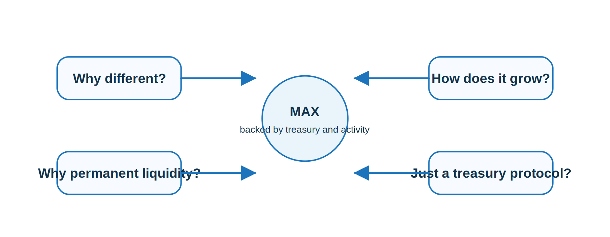

#  FAQ

## What backs MAX?

MAX is supported by treasury assets and the protocol’s internal capital formation mechanisms, including fees, bonding inflows, and liquidity-linked value capture.

## Why is Maxum different from typical DeFi tokens?

Most DeFi tokens rely on rented liquidity and emissions. Maxum is designed around productive, permanent liquidity and a treasury-backed flywheel.

## How does Maxum grow?

Through real activity. Trading fees, ecosystem revenue, and treasury expansion mechanisms all feed back into liquidity and market depth.

## Why does permanent liquidity matter?

Because it reduces fragility. Markets supported by retained system liquidity are more durable than markets that depend on temporary external incentives.

## Is Maxum just a treasury protocol?

No. Maxum combines treasury accumulation with active capital deployment. The treasury is used to reinforce liquidity, support markets, and expand the ecosystem.
