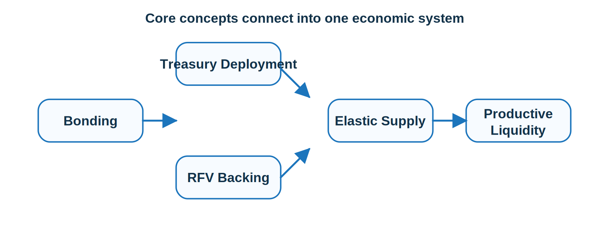

#  Glossary

**Productive, Permanent Liquidity**  
Liquidity retained by the system that continuously generates value through trading activity, fees, and ecosystem usage.

**RFV (Risk-Free Value)**  
The minimum stable asset value held in the treasury that backs circulating MAX.

**Bonding**  
A mechanism through which users exchange assets for discounted MAX, increasing treasury reserves.

**Economic Flywheel**  
The recurring loop in which activity generates fees, fees strengthen the treasury, the treasury expands liquidity, and liquidity supports more activity.

**Elastic Supply**  
A supply model in which MAX can expand when treasury backing and captured value increase.

**Treasury Deployment**  
The process of putting treasury capital to work in liquidity, market support, and ecosystem growth.
