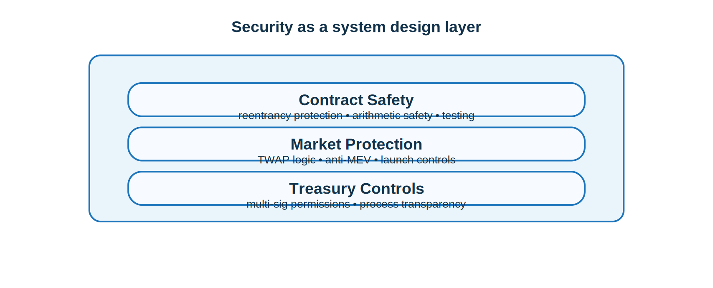

#  Security

Maxum prioritizes security at the protocol level. State-modifying functions that involve external calls are protected against reentrancy, arithmetic is handled with Solidity’s modern safety guarantees, and pricing logic can rely on time-weighted averages to reduce manipulation risk.

Launch controls and anti-MEV protections are designed to reduce the impact of automated sniping and hostile early-block behavior. Treasury permissions are intended to be secured behind a multi-signature architecture, and the protocol should undergo unit, integration, fuzz, and mainnet-fork testing before production deployment.

Security in Maxum is not only about contract correctness. It is also about protecting liquidity, treasury assets, and user confidence under real market conditions.

> [!NOTE]
> Security is part of the economic design, not just the codebase.
